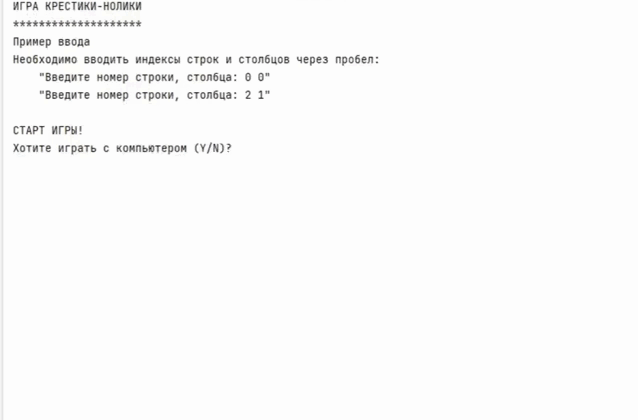

# Игра крестики-нолики
## Содержание

- [Описание](#описание-игры)
- [Установка](#установка-и-запуск)
- [Демонстрация](#демонстрация)

## Описание игры
Игра состоит из поля 3х3:
```python
    0 1 2
0   - - -
1   - - -
2   - - -
```
Перед началом игры, поле пустое. Затем, каждый игрок по очереди ставит в незанятую ячейку
значение. Игра продолжается до тех пор, пока всё поле не будет заполнено.\
Вы - __Пользователь "Х"__. Ваш ход всегда первый.\
Перед игрой вам будет задан вопрос `"Хотите сыграть с компьютером (Y/N)?"`.\
Если отвечаете __"Y"__ - будет игра с компьютером 
(ваш напарник, Пользователь "О", это функция, которая 
ставит "о" в свободную ячейку).\
Если __"N"__ - необходимо будет играть и за __Пользователя "Х"__ и за __"Y"__.


#### Как вводить значения для проставления "Х" и "О"
Водятся исключительно целые числа от 0 до 2 включительно!
Где, __первое__ значение - это __номер строки__, а __второе__ значение - это 
__номер столбца__.
Программа задаст вопрос `"Введите номер строки, столбца: "` после чего ожидает от вас два числа разделенных пробелом.
Любой другой ввод считается некорректным и вам будет предложенно ввести значение повторно.
#### Пример
```python
Текущая матрица:
    0 1 2
0   - - -
1   - - -
2   - - -

Введите номер строки, столбца: 0 1

Текущая матрица:
    0 1 2
0   - x -
1   - - -
2   - - -
```
## Установка и запуск
1. Убедитесь, что у вас установлен python версии 3.8 или выше.
2. Клонируйте этот репозиторий: `git clone https://github.com/SvetlanaKrasnova/game_x-o.git`
3. Запустите проект: `python main.py`


## Демонстрация


